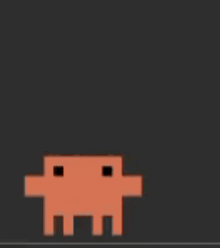
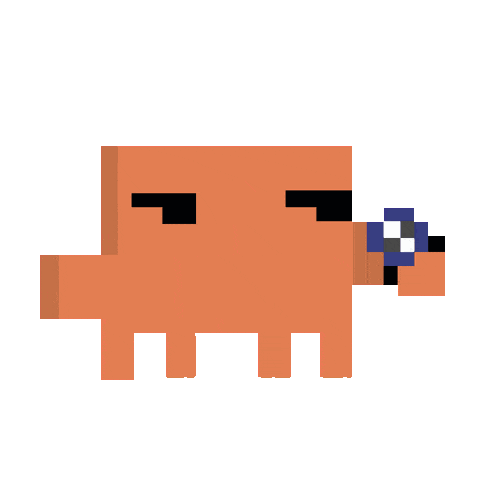
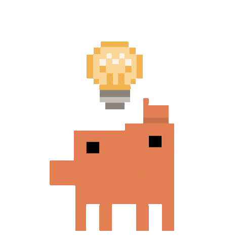
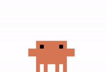
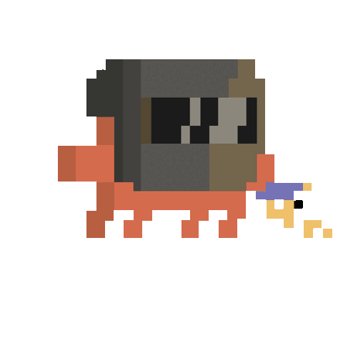
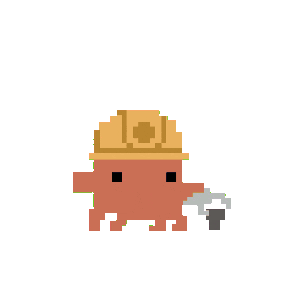
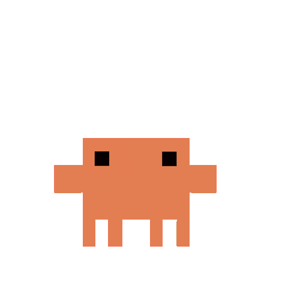
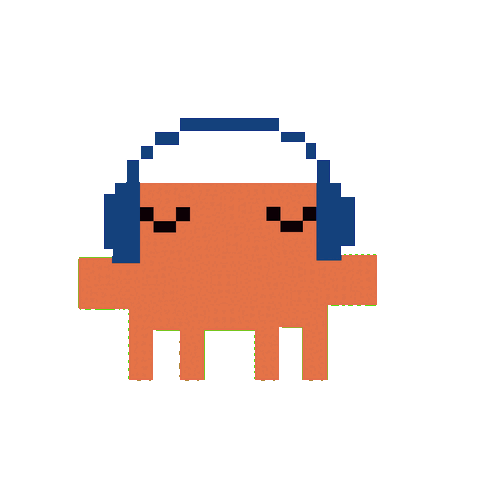

 

*ship it, break it, blame the agent*

---

| | | | | |
|:--:|:--:|:--:|:--:|:--:|
|  tap tap |  uhhh… |  where bug |  wait. wait. |  ✨ yolo |
|  hot metal |  bonk fix |  oopsie |  zen mode |  lofi.exe |

---

  

